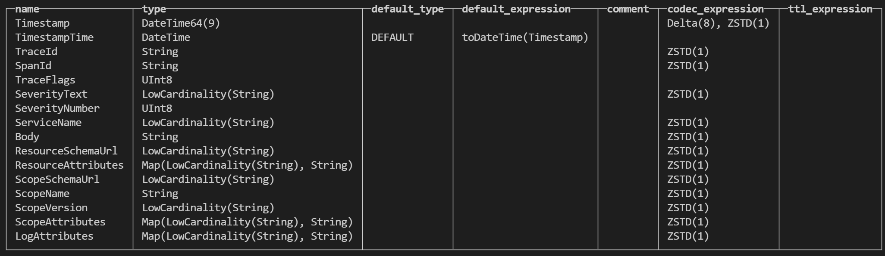
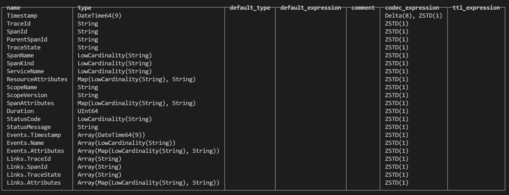
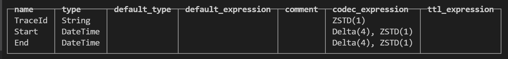
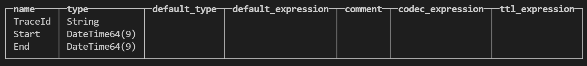

# clickhouse 日志 trace 存储与查询

## 1. 日志存储

表结构

clickhouse 常用命令

| 目的 | 命令 |
| --- | --- |
| 查看所有库 | ``SHOW ``DATABASES;`` |
| 创建库 | ``CREATE ``DATABASE ``otel;`` |
| 查看库里的表 | ``SHOW ``TABLES ``FROM ``otel;`` |
| 切换库 | ``USE ``otel;`` |
| 查看表结构 | ``DESCRIBE ``TABLE ``logs;`` |
| 查看建表 SQL | ``SHOW ``CREATE ``TABLE ``logs;`` |
| 查看前 N 行数据 | ``SELECT ``* ``FROM ``logs ``LIMIT ``10;`` |
| 统计行数 | ``SELECT ``count() ``FROM ``logs;`` |
| 查看某字段的所有值 | ``SELECT ``DISTINCT ``service ``FROM ``logs;`` |
| 查看表占用空间 | 查询 system.parts（见下） |
| 删除表 | ``DROP ``TABLE ``logs;`` |
| 删除库 | ``DROP ``DATABASE ``otel;`` |

## 2. trace 存储

表结构

 otel_traces

table otel_traces_trace_id_ts

describe table otel_traces_trace_id_ts_mv

